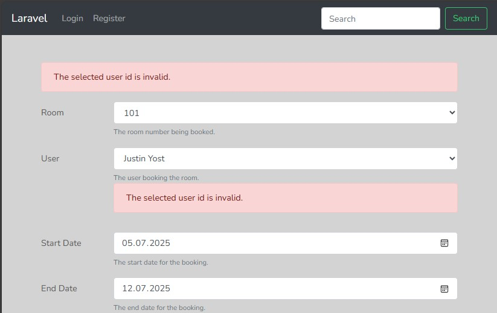

Неофициальный код  
https://github.com/seanmayer/laravel-essentials

## 03-Saving files

**Commit: Level Zero:**

> Запуск проекта на основе старого проекта

Запуск миграций

    php artisan migrate:fresh --seed

Установка зависимостей

    composer install

**Commit: 3. Saving files:**

> Создание новых фич

Создание новой миграции

    php artisan make:migration AddRoomTypePictures

Создание нового столбца в таблице room_types под хранение фотографий.   
Наполнение созданного файла и запуск миграции.  

    php artisan migrate

Создание ссылки на папку для хранения файлов. Эта ссылка по умолчанию игнорируется в gitignore.

    php artisan storage:link

Создание контроллера и указание на модель

    php artisan make:controller RoomTypeController --resource --model=RoomType

Добавить маршрут в `routes/web.php`.

Создать `resources/views/roomTypes/edit.blade.php` и заполнить содержимым. 

Корректировка контроллера в методах edit и update.  

По адресу `/room_types/1/edit` должно работать прикрепление фото с компа для комнаты.  
Далее будет создаваться дальнейший интерфейс.  

## 006-Displaying validation errors

## 008-Console commands

    php artisan

    php artisan tinker

Возможные команды в тинкере

    App\Room::first();
    App\Room::first()->id;
    10%3
    $x = 10%3; $x++; echo $x;

    exit

Создание собственных команд (например, для Cron сервера):

    php artisan make:command EmailReservationsCommand

Далее, редактирование полученного файла в app/Console/Commands, и

    php artisan list

В списке команд будет доступна наша новая команда. Но на данный момент она ничего не выполняет.

    php artisan reservations:notify

## 009-Console outputs

Выполнение команды закладывают в метод `handle()` класса команды.  

## 010-Console arguments

После модификации EmailReservationsCommand ввод команд

    php artisan reservations:notify one
    # выведет ошибку с созданным сообщением

    php artisan reservations:notify 1
    # будет выведена (подсчитана) одна строка

## 011-Console options

Команда для обработки опции

    php artisan reservations:notify 5 --dry-run

Если опция {--dry-run : } в классе указана с равно "{--dry-run= : }", то команда такая

    php artisan reservations:notify 5 --dry-run=Y

## 012-Console inputs

При использовании `$this->ask()` в `public function handle()` будут задаваться вопросы пользователю в консоли.

    php artisan reservations:notify 3

При использовании `$this->anticipate()` будут использоваться подсказки-заполнители для пользователя в консоли.

