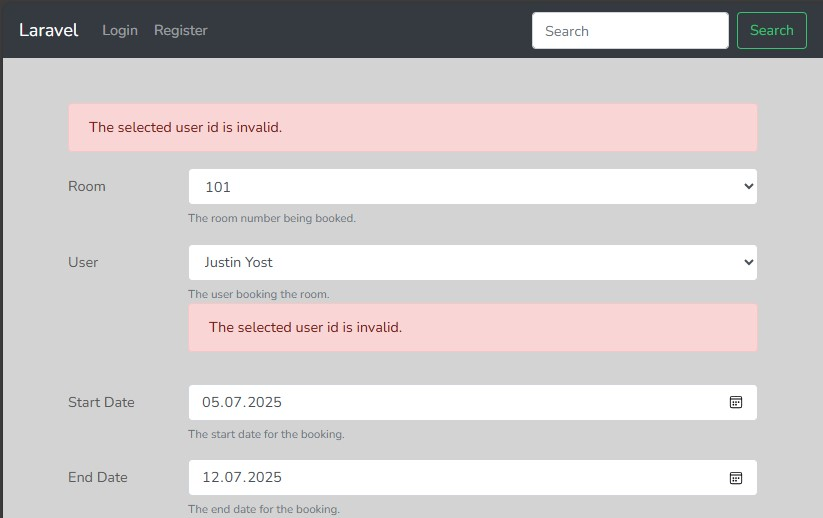

Неофициальный код  
https://github.com/seanmayer/laravel-essentials

## 03-Saving files

**Commit: Level Zero:**

> Запуск проекта на основе старого проекта

Запуск миграций

    php artisan migrate:fresh --seed

Установка зависимостей

    composer install

**Commit: 3. Saving files:**

> Создание новых фич

Создание новой миграции

    php artisan make:migration AddRoomTypePictures

Создание нового столбца в таблице room_types под хранение фотографий.   
Наполнение созданного файла и запуск миграции.  

    php artisan migrate

Создание ссылки на папку для хранения файлов. Эта ссылка по умолчанию игнорируется в gitignore.

    php artisan storage:link

Создание контроллера и указание на модель

    php artisan make:controller RoomTypeController --resource --model=RoomType

Добавить маршрут в `routes/web.php`.

Создать `resources/views/roomTypes/edit.blade.php` и заполнить содержимым. 

Корректировка контроллера в методах edit и update.  

По адресу `/room_types/1/edit` должно работать прикрепление фото с компа для комнаты.  
Далее будет создаваться дальнейший интерфейс.  

## 006-Displaying validation errors



## 008-Console commands

    php artisan

    php artisan tinker

Возможные команды в тинкере

    App\Room::first();
    App\Room::first()->id;
    10%3
    $x = 10%3; $x++; echo $x;

    exit

Создание собственных команд (например, для Cron сервера):

    php artisan make:command EmailReservationsCommand

Далее, редактирование полученного файла в app/Console/Commands, и

    php artisan list

В списке команд будет доступна наша новая команда. Но на данный момент она ничего не выполняет.

    php artisan reservations:notify

## 009-Console outputs

Выполнение команды закладывают в метод `handle()` класса команды.  

## 010-Console arguments

После модификации EmailReservationsCommand ввод команд

    php artisan reservations:notify one
    # выведет ошибку с созданным сообщением

    php artisan reservations:notify 1
    # будет выведена (подсчитана) одна строка

## 011-Console options

Команда для обработки опции

    php artisan reservations:notify 5 --dry-run

Если опция {--dry-run : } в классе указана с равно "{--dry-run= : }", то команда такая

    php artisan reservations:notify 5 --dry-run=Y

## 012-Console inputs

При использовании `$this->ask()` в `public function handle()` будут задаваться вопросы пользователю в консоли.

    php artisan reservations:notify 3

При использовании `$this->anticipate()` будут использоваться подсказки-заполнители для пользователя в консоли.

При использовании `$this->choice()` будут использоваться обязательные опции на выбор для пользователя в консоли.

## 013-Service providers

Файл app\Libraries\Notifications.php создан вручную.  

Далее следующая команда показывает, как срабатывает метод `Notifications@send()` на каждой итерации метода `EmailReservationsCommand@handle()`. 

    php artisan reservations:notify 3

## 014-Facades

Фасады используются совместно с AppServiceProvider.php для облегчения работы. Используя фасады не нужно знать, как создавать экземпляры класса или как внедрять класс в другие классы.

## 015-Interface service container binding

После установления класса интерфейса, используемая команда:

    php artisan reservations:notify 3

Интерфейсы позволяют указывать их вместо конкретных классов. Конкретный класс будет вызываться через реализацию интерфейса.

## 016-Automatic service container binding

Внедрение класса в консольные команды без регистрации этого класса в AppServiceProvider.  
Используется та же команда.  

    php artisan reservations:notify 3

## 017-Basic test

Создание функционального теста (feature test)

    php artisan make:test ShowRoomsControllerTest

Этой командой создаётся файл в `tests/Feature/ShowRoomsControllerTest.php` .

После доработки файла теста - Запуск теста из корня проекта (`phpunit` должен быть установлен глобально в переменной PATH).

    phpunit .tests/Feature/ShowRoomsControllerTest.php

или так (phpunit не установлен глобально)

    vendor/bin/phpunit  tests/Feature/ShowRoomsControllerTest.php

Ответ показывает количество тестов и пройденных на истину утверждений (asserts)

    .                       1 / 1 (100%)
    Time: 1.62 seconds, Memory: 18.00 MB
    OK (1 test, 4 assertions)

Запуск всех существующих тестов

    phpunit

или

    vendor/bin/phpunit

##  018-Database factories

Создание Фактори и привязка ее к модели 

    php artisan make:factory RoomTypeFactory --model=RoomType

Описание API Фэйкера Faker

https://github.com/fzaninotto/Faker

Для создания теста дозаполняются файлы 
- `database\factories\RoomTypeFactory.php`,
- `database\factories\RoomFactory.php`,
- `tests\Feature\ShowRoomsControllerTest.php`.

Для выполнения теста Factory нужно создать новую БД

    php artisan tinker

Далее в тинкере

    DB::statement('CREATE DATABASE test;');

Выход из тинкера `Ctrl+C`. В файле `phpunit.xml` в корне указать использовать фейковую БД. Будет создана временная БД в памяти.  

    <server name="DB_DATABASE" value="test"/>

С каждым новым тестом обновлять фейковую БД, когда используешь ее, указав это в файле `tests\Feature\ShowRoomsControllerTest.php`.
 
    class ShowRoomsControllerTest extends TestCase
    {    
    use RefreshDatabase;
    //...
    }

Сам тест

    phpunit
    // или
    vendor/bin/phpunit

## 019-As a user

> Test as a user

Создать тест

    php artisan make:test HomeControllerTest

В редакторе настроить тест для тестирования пользователя, вошедшего в систему.  

Запуск теста

    vendor/bin/phpunit

    .....   5 / 5 (100%)
    Time: 9.68 seconds, Memory: 24.00 MB
    OK (5 tests, 13 assertions)

Далее - создаём тест `testLoggedOut` для проверки редиректа пользователя, невошедшего в систему.

Реран юнит-теста.

    vendor/bin/phpunit

    ......   6 / 6 (100%)
    Time: 4.63 seconds, Memory: 24.00 MB
    OK (6 tests, 16 assertions)

## 020-Facades

> Test of Facade

CLI:

    php artisan make:test RoomTypeControllerTest

Кооректировка `app\Http\Controllers\RoomTypeController.php` и Запуск теста

    vendor/bin/phpunit

## 021-File uploads

> Test of File uploads

    phpunit
    # или
    vendor/bin/phpunit

Для выполнения этих тестов обязательно должна быть библиотека PHP GD, и устанавливается она с трудом.  
Текущий файл Dockerfile правильно настроен для установки GD.  
https://github.com/byCedric/Docker/issues/9  


## 022-Console commands

> Unit test

Создать юнит-тест (модульный тест) вместо функционального теста (feature-test), как делалось ранее.  
Функциональные тесты предназначены для тестирования всей функции сразу, в то время как модульный тест предназначен для тестирования одного блока кода.    

    php artisan make:test EmailReservationsCommandTest --unit

## 023-Emails

Mailhog - для тестирования отправляемой почты (которая, на самом деле, никуда не уходит).

https://laravel.com/docs/6.x/homestead#configuring-mailhog

Настройками Mailhog из документации заменяем соответствующие строки MAIL в файле .env . 

```
MAIL_DRIVER=smtp
MAIL_HOST=localhost
MAIL_PORT=1025
MAIL_USERNAME=null
MAIL_PASSWORD=null
MAIL_ENCRYPTION=null
```

Доступ к внутреннему почтовому приложению теперь будет по умолчанию по адресу:  `http://localhost:8025`.

Команда, которая создаст новый email класс. 

    php artisan make:mail Reservations --markdown=emails.reservation

Она создаст файлы
- `app\Mail\Reservations.php`
- `resources\views\emails\reservation.blade.php`

Эта часть удалена из последнего файла и заменена своим кодом

    The body of your message.

    @component('mail::button', ['url' => ''])
    Button Text
    @endcomponent

После корректировки файла `app\Libraries\Notifications.php` команда отправки письма

    php artisan reservations:notify 1

Некоторые из настроек писем можно задавать глобально в файле `config\mail.php`. 

###  Connection could not be established with host localhost :stream_socket_client(): unable to connect to localhost:1025 (Cannot assign requested address)

Возможна проблема. Вызвана она использованием Docker'a и тем, что подразумевается под localhost, который указывается в .env.

https://laracasts.com/discuss/channels/laravel/help-for-laravel-sail-rabbitmq

    "Конфигурация хоста. Поскольку вы используете Docker, localhost может не указывать на тот хост, который вы ожидаете. Если RabbitMQ работает как отдельная служба в Docker, в качестве хоста следует использовать имя службы, указанное в docker-compose.yml, а не localhost или 127.0.0.1."

Таким образом, решение - в изменении параметра MAIL_HOST, указав имя службы из docker-compose.yml

```
MAIL_DRIVER=smtp
MAIL_HOST=mailhog  # имя службы из docker-compose.yml
MAIL_PORT=1025
MAIL_USERNAME=null
MAIL_PASSWORD=null
MAIL_ENCRYPTION=null
```

Доступ по `http://localhost:8025`, согласно `docker-compose.yml`

```yml
    mailhog:  
    image: mailhog/mailhog  
    ports:
      - "1025:1025" # порт SMTP   
      - "8025:8025" # порт веб-интерфейса MailHog  
```

Корректировка файлов  
`app\Libraries\Notifications.php`  
`app\Mail\Reservations.php`  
способствует отправке для  имени человека в письме - **переменной** вместо отправки **строки** имени. Для этого используется настройка конструтктора класса `Reservations`.      
Команда та же.  

    php artisan reservations:notify 1

В продакшн-среде достаточно поменять параметры MAIL файла `.env` на данные своего провайдера почты.  

## 024-Notifications

Создание класса для уведомлений

    php artisan make:notification Reservation

После корректировки файлов
- `app\Notifications\Reservation.php`
- `app\Booking.php`
- `app\Console\Commands\EmailReservationsCommand.php`

вызвать команду для отправки письма-уведомления при бронировании:

    php artisan reservations:notify 1

Проверить в браузере через mailhog 

    localhost:8025

## 025-Queue jobs

> Простейший job

Создать класс джоба, задания

    php artisan make:job ProcessBookingJob

После настройки   
- `app\Jobs\ProcessBookingJob.php`  
- `app\Http\Controllers\BookingController@update`   

вызываем обновление на странице `http://localhost:8180/bookings` и получаем задержку в 5 секунд, которую настроили в `ProcessBookingJob`.  

> Использование БД

Добавить таблицу очередей в БД.  
Create a migration for the queue jobs database table.  

    php artisan queue:table

Запуск миграций, создание таблицы

    php artisan migrate

В `.env` файле вместо

    QUEUE_CONNECTION=sync

поставить

    QUEUE_CONNECTION=database

После настройки `app\Http\Controllers\BookingController@update` вызываем обновление на странице `http://localhost:8180/bookings` и уже не получаем задержку в 5 секунд, которую настроили в `ProcessBookingJob`.  

## 026-Queue workers

Запустить jobs. Так запускается по одному worker'у для выполнения каждого job.  

    php artisan queue:work

    Ctrl+C

Запуск нескольких jobs. Запустить Tinker

    php artisan tinker

Получить все бронирования в Тинкере

    $bookings = App\Booking::all()

Отправлять новое job для каждой записи бронирования. Повторить этот запрос несколько раз. Будет создана хорошая коллекция заданий jobs.

    $bookings->each(function($item) { \App\Jobs\ProcessBookingJob::dispatch($item); } );

Выйти из Тинкера

    exit

Если запустить выполнение jobs, то видно, что работает только один worker, выполняются задачи по одной, по очереди (каждые 5 секунд, согласно настройке в `app\Jobs\ProcessBookingJob.php`)

    php artisan queue:work

    Ctrl+C

> Supervisor

Супервизор выполняет процессы в фоне и может перезапускать их при необходимости.  

    sudo nano /etc/supervisor/conf.d/laravel-workers.conf

Вставить контент из файла упражнений `laravel-worker.conf`.  Сохранить, выйти.  

    Ctrl + O
    Enter
    Ctrl + X

Если возникли проблемы с существованием этого файла nano в Докере:

    apt install nano
    nano -V

    mkdir /etc/supervisor/
    mkdir /etc/supervisor/conf.d/

    nano /etc/supervisor/conf.d/laravel-workers.conf

    Ctrl + O
    Enter
    Ctrl + X

    cat /etc/supervisor/conf.d/laravel-workers.conf

Запустить

    sudo supervisorctl reread
    sudo supervisorctl update
    sudo supervisorctl start laravel-worker:*

Если возникли проблемы с supervisor

    apt install supervisor    

Посмотреть лог

    cat worker.log

## 027-Task scheduler

Планировщики в отличие от очереди запускаются по обязательному расписанию. Очереди запускаются по какому-то событию.  
Планировщик задач настраивается в `app\Console\Kernel.php`.  
Здесь настраивается `protected function schedule()` и далее настраивается планировщик CRON. Crontab - это файл, который сообщает CRON'у Linux'a, какие команды выполнять.  

В терминале

    crontab -e

Создавая файл cronttab в nano в самом низу файла для папки нашего проекта `/html` сообщаем CRON, что нужно каждую минуту каждого дня каждого месяца перейти в приложение Laravel и запустить команду расписания php artisan.

    * * * * * cd /var/www/html/ && php artisan schedule:run >> /dev/null 2>&1

Сохранить файл

    Ctrl+O
    Ctrl+X

## 028-Route parameters

После настройки маршрута и проверки dd() в контроллере в браузере можно проверить результат по адресу `/rooms/testing`.

Дальнейшая обработка котроллера позволяет использовать адреса типа  
`http://localhost:8180/rooms/foo/2` - все вторые  
`http://localhost:8180/rooms/test/3` - все третьи
`http://localhost:8180/rooms/anyword` - все комнаты

В аргументах контроллера используется `(Request $request, string $name, $roomType = null)`, в маршруте `'/rooms/{name}/{roomType?}'`. На этой основе можно запускать адреса типа `http://localhost:8180/rooms/foo/2`.

## 029-Route model binding

Здесь, после настройки контроллера и маршрута, после фнкции dd() будет получен экземпляр App\RoomType по адресу, например, http://localhost:8180/rooms/2. А вызов несуществующего id выдаст 404& например по адресу http://localhost:8180/rooms/300.  
В контроллер передаём id `Room::byType($roomType->id)`.

# 030-Middleware

Middleware в Laravel нужен для фильтрации HTTP-запросов приложения. Он может проверять, изменять или отклонять запросы на основе определённых условий.  

Некоторые задачи, для которых используется middleware:  
- Собственные проверки аутентификации. 
- Автоматическое журналирование запросов.
- Ограничение доступа
- Ведение логов времени отклика для мониторинга производительности.

В Laravel есть несколько стандартных middleware, например, для аутентификации и CSRF-защиты. Также можно создавать пользовательские middleware. 

В терминале выполнить

    php artisan make:middleware CheckQueryParam

После задания своего кода в `app\Http\Middleware\CheckQueryParam.php`, добавить middleware в файл маршрутов `routes\web.php`.  

В браузере `http://localhost:8180/test` будет работать нормально. Но с другой строкой страница будет работать согласно настройкам в middleware, например, при `http://localhost:8180/test?test=123`, будет вызвана настроенная в middleware страница 404.  

Middleware можно применить для целого набора маршрутов.  

Для этого в `app\Providers\RouteServiceProvider.php` для раздела с web-маршрутами можно добавить свой middleware. 

В этом случае под 404 попадут и дргуие запросы, например, `http://localhost:8180/rooms?test=123`.

## 031-Installing and running Laravel Mix

Laravel Mix нужен для упрощения процесса компиляции и сборки активов в веб-приложениях, в основном в проектах Laravel. Это инструмент, который выступает как упрощённый интерфейс для Webpack, позволяя разработчикам фокусироваться на оптимизации активов, а не на сложных конфигурациях Webpack.  

В Windows можно использовать команду `yarn` вместо `npm`.

    yarn install
    yarn run dev

Установка npm в linux

    sudo apt update
    sudo apt install npm
    npm -v

Установка Mix в проект, набрать команду в папке проекта.  
(У меня не работает из-за самоподписанного сертификата в цепочке url запросов).

    npm install
    
Создание микса из своих css и js файлов в режиме dev

    npm run dev

## 032-CSS processing

Файл `webpack.mix.js` указывает пути, какие файлы использовать и в какие папки помещать результат создания css и js.  

Команда, выполняющая эту работу

    npm run dev

Команда, которая превращает /public/css в минимизированный css для продакшена

    npm run prod

## 033-JavaScript processing

Создание `app.js.map` файла. -   
Добавить в `webpack.mix.js` код `.sourceMaps()` и вызвать команду  

    npm run prod

Следующая команда постоянно выполняется, она перекомпилирует файлы микса, если заметит внесённые изменения:

    npm run watch-poll

## 034-Authentication

В Laravel 6 делается так  

    composer require laravel/ui --dev

Это создаёт пакет `ui` в папке `laravel`: `vendor\laravel\ui`.

Далее команда, которая создаёт внешний вид файлов входа и выхода. Но это необязательная команда. Сам скелет входа создан по при установке фреймворка. Эта команда показывает пример создания окончательного решения.

    php artisan ui view --auth

> Установка Composer при необходимости

https://getcomposer.org/download/

Установить необходимые PHP-расширения: 

    sudo apt install curl php-cli php-zip php-curl php-mbstring git unzip.

Проверить доступность расширений: 

    php -m | grep -E "(curl|zip|mbstring|json|xml)"

Загрузить официальный скрипт установщика: 

    php -r "copy('https://getcomposer.org/installer', 'composer-setup.php');"

Проверить целостность скрипта:  

    php -r "if (hash_file('sha384', 'composer-setup.php') === 'c8b085408188070d5f52bcfe4ecfbee5f727afa458b2573b8eaaf77b3419b0bf2768dc67c86944da1544f06fa544fd47') { echo 'Installer verified'.PHP_EOL; } else { echo 'Installer corrupt'.PHP_EOL; unlink('composer-setup.php'); exit(1); }"

Если хэш совпадает, выполнить установку: 

    php composer-setup.php

Поместить composer в глобальный Путь. Установка в /usr/local/bin обеспечивает, что Composer станет доступен по всей системе без необходимости в абсолютных путях.  

    echo $PATH
    mv composer.phar /usr/local/bin/composer

Проверить установку: 

    composer --version.

## 035-Route authorization

Можно реализовать ограничение доступа неавторизованных пользователей к отдельным маршрутам или ко всем маршрутам выбранного контроллера.

К маршруту. Код в `routes\web.php`

```php
// доступ к этой странице будет ограничен без авторизации
Route::get('/test', function() {return "Goodbye";})->middleware('auth');
```

К контроллеру. Код в выбранном контроллере

```php
    // такая конструкция в контроллере обеспечит ограничение доступа 
    // для неавторизованных пользователей ко всему контроллеру
    public function __construct()
    {
        $this->middleware('auth');
    }
```

## 

